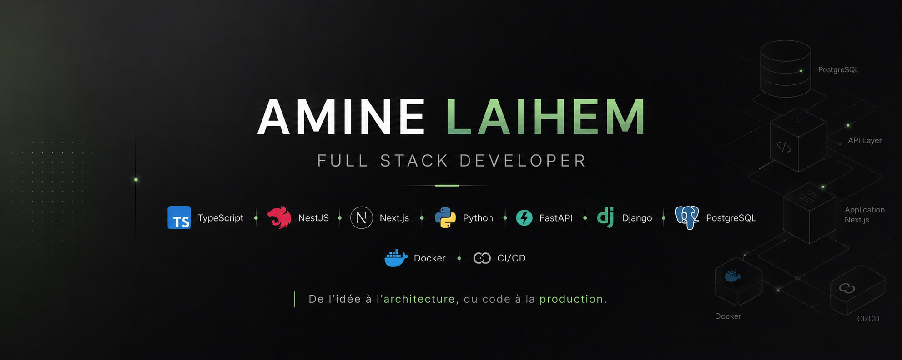

<p align="center">
  
</p>

<h1 align="center">Hi, I'm Amine 👋</h1>

<p align="center">
  <strong>Full Stack Developer</strong> · Backend & Architecture · AI-powered products
</p>

<p align="center">
  I design maintainable systems and ship web, desktop & AI solutions from idea to production.
</p>

<p align="center">
  <a href="https://linkedin.com/in/laihem-amine">
    
  </a>
  &nbsp;
  
  &nbsp;
  
</p>

---

## About

```text
🇫🇷  France
💼  Full Stack Developer
🏗️  Backend & Software Architecture
🤖  AI & LLM Applications
🚀  Product Development
📚  Continuous learner
```

---

## Tech Stack

### Core

<p align="center">
  
</p>

### Backend

<p align="center">
  
</p>

### Frontend

<p align="center">
  
</p>

### Data & Infra

<p align="center">
  
</p>

### Quality, Observability & AI

<p align="center">
  
  
  
  
  
  
  
  
  
</p>

<p align="center">
  
  
  
  
  
</p>

---

## Featured Projects

<table>
<tr>
<td width="50%" valign="top">

### 📬 Nemeton

Local-first **Outlook → Teams** assistant.

Electron + React + TypeScript app that turns emails into structured, actionable briefs.

**Highlights**
- Electron · Microsoft Graph · Ollama
- SQLite · automated pipeline · Zod
- Vitest · Playwright · privacy-first

</td>
<td width="50%" valign="top">

### 🍽️ Savoors

Marketplace connecting **private chefs** and customers.

**Stack**
NestJS · Next.js · PostgreSQL · Stripe Connect · Docker · CI/CD · OpenAPI · VPS

**Highlights**
- Full-stack architecture · payments
- Booking flows · monitoring & observability
- Production-ready backend

</td>
</tr>
<tr>
<td width="50%" valign="top">

### 🤖 AI Platform

AI-powered app built around **FastAPI**, PostgreSQL and LangChain.

**Highlights**
- FastAPI · SQLAlchemy · PostgreSQL
- Open-source LLMs · LangChain orchestration
- Business workflow automation

</td>
<td width="50%" valign="top">

### 🛒 ETICShop · ☁️ MyEticNet

B2B & SaaS solutions at **ETIC Europe**.

**ETICShop** — Node.js · Prisma · React · Next.js · Docker · SonarQube

**MyEticNet** — PHP · MySQL · internal SaaS tools

**Corporate site** — WordPress · SEO · UX · performance

</td>
</tr>
</table>

---

## Experience

### Assystem — Full Stack Developer

Internal business apps & transversal IT referent.

`Python` `Django` `React` `PostgreSQL` `AI/ML` `Docker` `CI/CD` `Architecture` `DAT & DEX`

---

### ETIC Europe — Full Stack Developer

B2B and SaaS products — see **Featured Projects** above.

---

### Sadem Informatique — Internships *(2022 → 2024)*

Three consecutive internships across full-stack delivery.

| Project | Stack |
| --- | --- |
| Internal Management App | MERN · JWT |
| Collaborative Platform | REST · MongoDB · Angular · Jest · Swagger |
| HR Management System | PostgreSQL · React · Express · OAuth · Swagger |

---

## Current Focus

<p align="center">
  
  
  
  
  
  
  
</p>

---

## Philosophy

<p align="center">
  <em>Build products that solve real problems.</em><br/>
  <em>Prioritize maintainability over complexity.</em><br/>
  <em>From idea → architecture → production.</em>
</p>

---

<p align="center">
  
</p>

<p align="center">
  <strong>Let's build something meaningful.</strong><br/>
  <a href="https://linkedin.com/in/laihem-amine">linkedin.com/in/laihem-amine</a>
</p>
